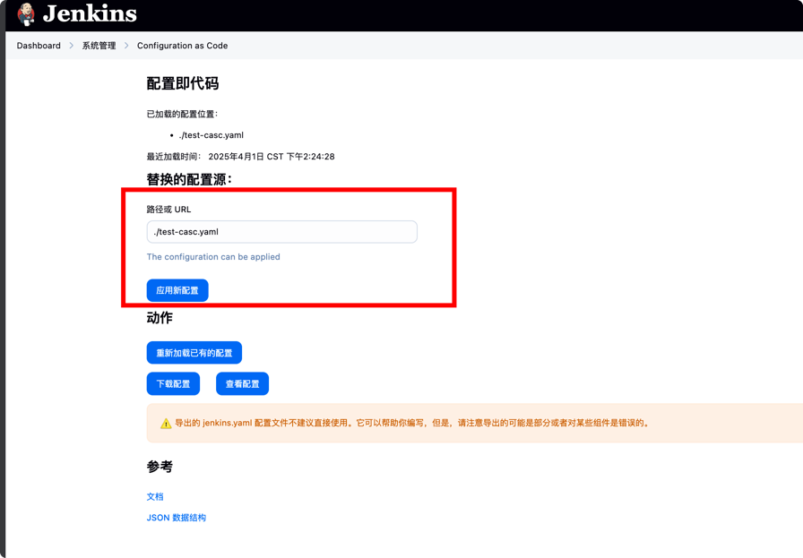
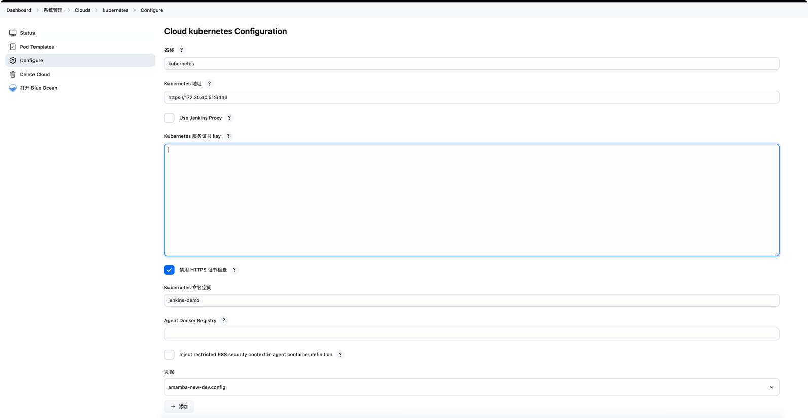

# 如何升级Jenkins及插件

## 升级流程

### 环境准备

> 本地需要准备java和go环境

1. 下载jenkins war包

   在 [jenkins官方仓库](https://github.com/jenkinsci/jenkins)的release页面找到指定的版本，下载war包；

```shell
JENKINS_VERSION=2.502
wget https://github.com/jenkinsci/jenkins/releases/download/jenkins-$JENKINS_VERSION/jenkins.war
```

2. 下载jenkins-plugin-manager的jar包

```shell
TOOL_VERSION=2.13.2
wget https://github.com/jenkinsci/plugin-installation-manager-tool/releases/download/$TOOL_VERSION/jenkins-plugin-manager-$TOOL_VERSION.jar
```

### 下载插件

注意：如果需要更新jenkins的版本，那同时需要更新formula.yaml, formula.core.yaml 中的jenkins war的版本。

下载jenkins-plugin-manager，使用此工具对插件进行管理：
```shell
JENKINS_HOME="jenkins_home" # 本地jenkins_home目录，jenkins的数据，密码等信息存放在这个目录中, 如果不指定，则默认为 ~/.jenkins
java -jar jenkins-plugin-manager-$TOOL_VERSION.jar  --war jenkins.war --plugin-download-directory $JENKINS_HOME/plugins -l --output yaml -f formula.core.yaml
```

> 虽然某些插件可能并没有在 formula.core.yaml 中声明，但是在下载插件时会下载依赖的插件，所以不用担心；😊

执行完以后可以在 $JENKINS_HOME/plugins 目录下看到所有的插件；

### 启动jenkins

```shell
JENKINS_HOME="jenkins_home" java -jar jenkins.war
```

jenkins启动以后，通过 `http://localhost:8080` 访问jenkins；

jenkins的密码可以在控制台看到，或者在 $JENKINS_HOME/secrets/initialAdminPassword 文件中查看；

> Tip: 初次进入jenkins时可能会直接重定向到 error 页面，这是因为jenkins的location配置不正确，需要修改。 
> 在浏览器中输入 `http://localhost:8080/manage/` 进入系统配置，将 `Jenkins Location` 修改为 `http://localhost:8080/`；


### 更新插件

可以在jenkins的插件管理页面中查看相关的插件，按照需要更新/安装/卸载插件；

> 插件信息可以在 [jenkins插件中心](https://plugins.jenkins.io) 中进行查找 

### 更新formula.yaml

当通过页面更新完插件以后，执行以下命令将插件信息导出到yaml文件中；

```shell
java -jar jenkins-plugin-manager-$TOOL_VERSION.jar  --war jenkins.war --plugin-download-directory $JENKINS_HOME/plugins -l --output yaml > plugins.yaml

```

可以在 plugins.yaml 中看到所有的插件信息，现在需要将其和 formula.yaml 中的插件信息进行合并

执行以下命令
```shell
go run hack/update-formula/updateformula.go
```
> 注意查看日志中是否有错误信息输出，可能某些插件的groupID没有找到，那么需要手动在github的仓库中查找对应的插件的pom.xml文件，添加到  formula.new.yaml 中；

执行完命令以后，会生成一份 formula.new.yaml 文件，将其中的plugins部分拷贝到 formula.yaml 中即可；

### 本地验证

现在 formula.yaml 中的插件信息已经更新，可以基于新的 formula.yaml 文件重新构建jenkins的war包，然后验证功能是否正常, 执行以下命令进行构建：

```shell
jcli cwp --install-artifacts --config-path formula.yaml --batch-mode --show-progress  
```

构建完成后会在 `tmp/output/target` 目录下生成jenkins-1.0-SNAPSHOT.war文件，war包中已经包含了插件，可以直接运行；

```shell
java -jar tmp/output/target/jenkins-1.0-SNAPSHOT.war
```

之后进入jenkins中进行重新验证功能是否正确

### 容器环境验证

除了本地验证外，因为jenkins是部署在k8s集群中的，需要在k8s的环境中去进行验证（因为除了war包外，jenkins的行为还与casc, groovy, JAVA-OPTS 等配置有关，也需要进行验证），需要准备以下文件：

- **一个k8s集群及其kubeConfig文件**

- CASC.yaml 文件

  > 本文中的jenkins ip为172.30.40.51，需根据实际情况进行修改

  可以复制现有的CASC文件进行修改，主要修改以下配置：
    ```yaml
    jenkins:
      clouds:
        - kubernetes:
            credentialsId: k8s-service-account   # 连接k8s的凭证，创建方式看下文
            jenkinsTunnel: "172.30.40.51:50000"  # jenkins的tunnel地址，值为 ip:50000 （端口配置看下文）
            jenkinsUrl: "http://172.30.40.51:8080/" # jenkins的web地址，通过此地址可打开UI界面，默认的端口号为8080
            serverUrl: https://172.30.40.51:6443  # 集群k8s apiServer的地址
            name: kubernetes
            namespace: jenkins-demo  # jenkins所在的namespace
    ```
启动jenkins

```shell
java -jar tmp/output/target/jenkins-1.0-SNAPSHOT.war   
```  

#### 配置jenkins

1. 在 系统管理 -> 全局安全配置 -> 代理(TCP port for inbound agents ?) 中将禁用改为 “指定端口”，端口值为50000，点击保存
2. 在 系统管理 -> 凭据管理 -> 全局 中创建一个全局凭据，类型选择 “secret file”, 凭据名称为“k8s-service-account”（对应着casc文件里的“credentialsId”配置项），凭据的内容为k8s的kubeconfig
3. 在 系统管理 -> Configuration as Code 中导入CASC.yaml文件，如果无误点击 “应用新配置
   
4. 检察，在 系统管理 -> Clouds 中应该会出现一个 “kubernetes”, 点击进入 Configure 页面


填写 Kubernetes 服务证书 key。 它的值为k8s的kubeConfig文件中的 `certificate-authority-data`, 注意需要将其进行base64解码。

检查 【凭据】 选项，它的值为第二步中创建的凭据，值是kubeConfig文件名.

上面一系列步骤都准备就绪后，即可开始验证jenkins及其插件功能是否正常。

#### 验证插件

1. 创建一条pipeline，内容如下：
```groovy
pipeline {
  agent {
    node {
      label 'base'           # 为了验证是否能正常使用base agent
    }

  }
  stages {
    stage('Stage-sPhNA') {
      steps {
        script {
          def buildTime = new Date().format("yyyy-MM-dd HH:mm:ss", TimeZone.getTimeZone('Asia/Shanghai'))
          currentBuild.description = "本次构建时间 ${buildTime}"
          }

        }
      }
    }
  }
```
2. 点击构建，查看构建日志，确认是否正常构建

在构建的过程中可能会出现jnlp连接的错误，需要检查以下几点：
- jnlp镜像的版本，可以在dockerhub上选择合适的版本，例如 `jenkins/inbound-agent:jdk17`
- jnlp无法连接jenkins master，需要检查
    - 启动jenkins的时候JENKINS_OPTS 是否包含 “-Djenkins.model.Jenkins.slaveAgentPort=50000”
    - jenkins的50000端口是否能连接，通过 `telnet jenkinsIP 50000` 进行检查
    - jnlp容器是否能够访问到jenkins的50000端口
    - casc文件中的 jenkinsTunnel 是否正确
    - 【配置jenkins】章节中的代理是否配置正确

如果配置正确，上述流水线应该可以正常运行。